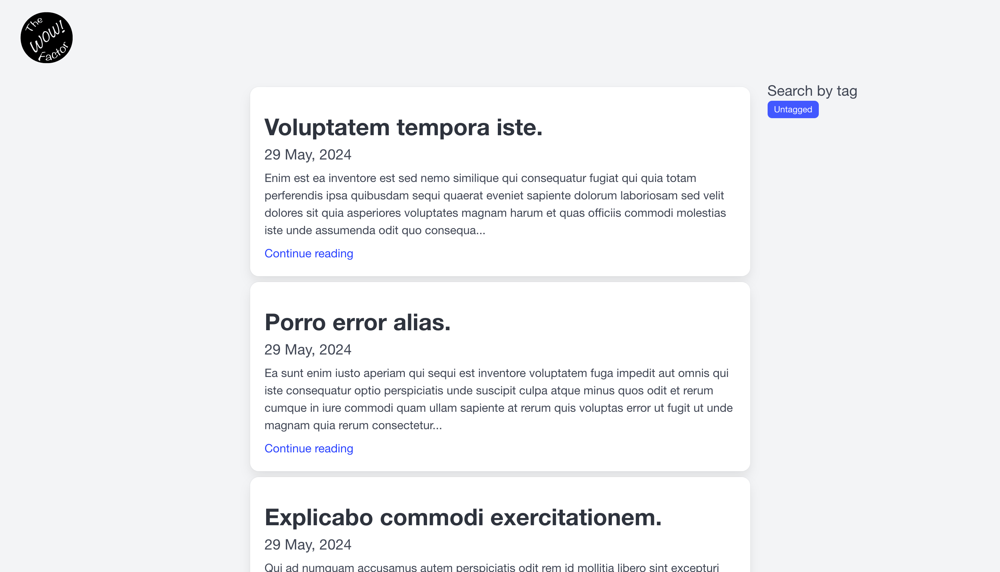
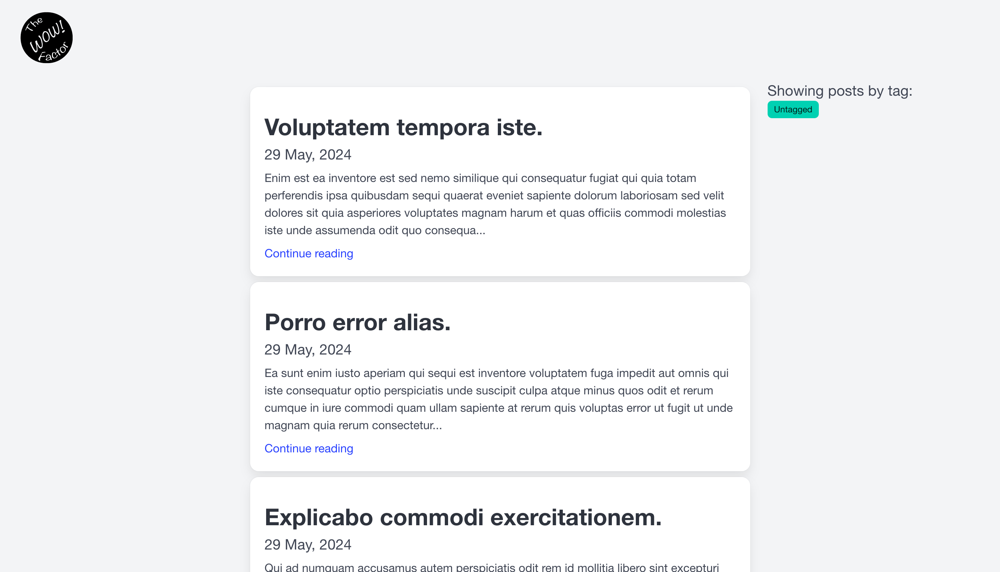
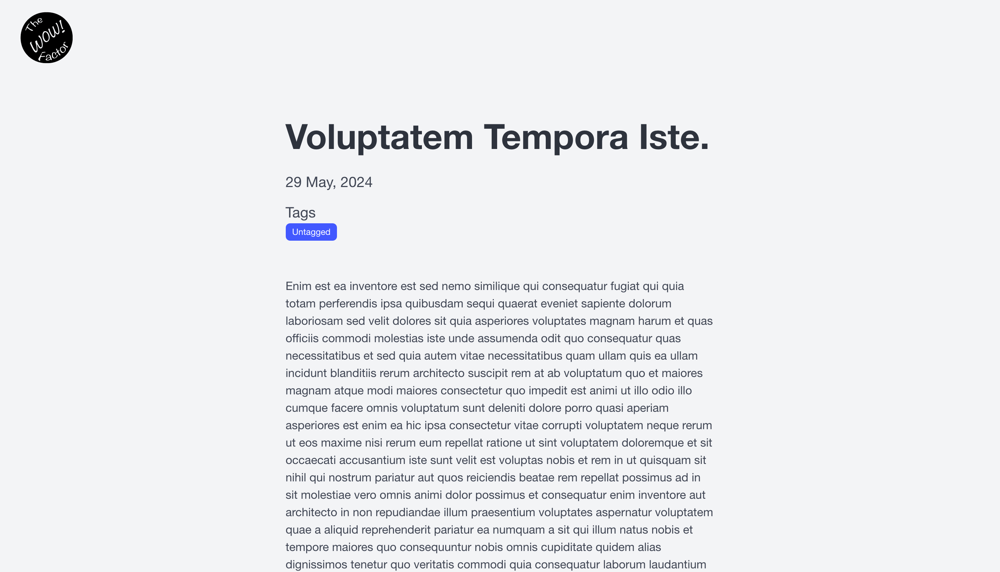

Blog originally built with Ruby on Rails 5. Now upgraded to Ruby on Rails 7, with Turbo working.
- Supports rich text editing with the Trix Editor and Action Text
- Devise for authentication, Sign up, Lost Password and other authentication related flows
- Upgraded to Ruby on Rails 7.
- Ruby 3.2.x
- Using [Bulma](https://bulma.io)
- Using [Slim](https://github.com/slim-template/slim) for templates
- Sqlite for the database

---
### New Home page

### New Search Results page

### Post rendered

Some old features still need work to be brought back:
- Async image loading from Cloud Provider
- Photo Gallery
- Trix (currently broke, due to styling maybe?)
- Dashboard
- Analytics
- Error tracking/Logging
